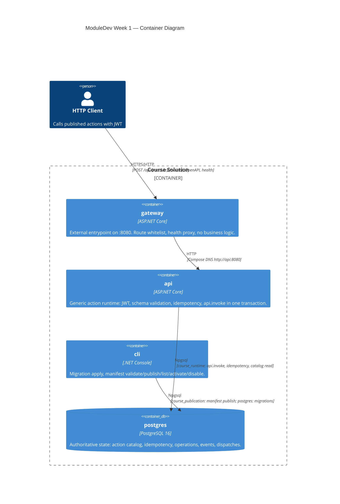

# C4 Container Diagram — Week 1

## Responsibilities

| Container | Trust | Data access |
|---|---|---|
| gateway | Untrusted HTTP surface | None — pure reverse proxy |
| api | JWT verification, policy at HTTP boundary | `api.invoke` only; no direct DML on domain tables |
| cli | Publication credentials | `course_publication` + migration role |
| postgres | Source of truth | All durable state |

## Key flows

1. **Action execution:** Client → gateway → api → (validate JWT, schema) → BEGIN → api.invoke → target function → validate outcome/result → COMMIT or ROLLBACK.
2. **Publication:** Operator → cli → INSERT action_versions + action_state (immutable version, mutable enabled/is_default).
3. **Recovery:** Recreate gateway/api containers; PostgreSQL volume persists operations and idempotency records.
